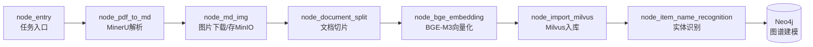
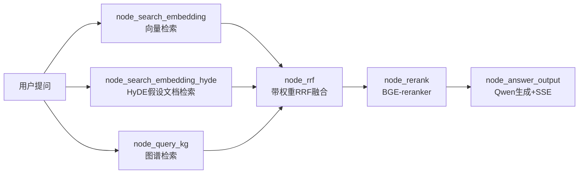

# 系统架构

## 总体链路

```
┌──────────────┐     ┌─────────────────────── 导入流水线（LangGraph） ───────────────────────┐
│  PDF / Word  │ --> │ MinerU解析 → Markdown图片处理 → 文档切片 → BGE-M3向量化 → Milvus入库  │
└──────────────┘     │                                        ↓                             │
                     │                            实体识别（LLM）→ Neo4j图谱建模            │
                     └────────────────────────────────────────────────────────────────────┘

┌──────────────┐     ┌─────────────────────── 检索问答（LangGraph） ─────────────────────────┐
│   用户提问    │ --> │ Embedding检索 ─┐                                                      │
└──────────────┘     │ HyDE检索 ────────┤→ RRF融合 → BGE-reranker重排 → Qwen生成 → SSE流式回答 │
                     │ Neo4j图谱检索 ───┘                                                      │
                     └────────────────────────────────────────────────────────────────────┘
```

## 导入流水线（import_process）



| 节点 | 职责 | 关键实现 |
|---|---|---|
| `node_entry` | 接收导入任务，初始化 state | `app/import_process/agent/state.py` |
| `node_pdf_to_md` | PDF/Word → Markdown | MinerU API |
| `node_md_img` | Markdown 内图片下载 | MinIO 对象存储 |
| `node_document_split` | 语义切片 | 递归切分 + 长度控制 |
| `node_bge_embedding` | dense + sparse 向量 | BGE-M3（混合检索） |
| `node_import_milvus` | 向量入库 | Milvus 2.x |
| `node_item_name_recognition` | 商品/实体名抽取 | Qwen LLM |

## 检索问答（query_process）



### RRF 融合公式

$$score(d) = \sum_{s \in sources} w_s \cdot \frac{1}{k + rank_s(d)}$$

- `k=60` 平滑常数，避免头部文档优势过大
- 每路检索源可配置独立权重 `w_s`
- 实现见 `app/query_process/agent/nodes/node_rrf.py`（单元测试见 `tests/test_rrf.py`）

## 存储层

| 存储 | 用途 | 封装 |
|---|---|---|
| Milvus | 向量（dense+sparse）检索 | `app/clients/milvus_utils.py` |
| Neo4j | 实体关系图谱检索 | `app/clients/neo4j_utils.py` |
| MongoDB | 会话历史 / 任务元数据 | `app/clients/mongo_history_utils.py` |
| MinIO | 原始文档 / 图片对象存储 | `app/clients/minio_utils.py` |

## 可观测性

- 分级日志：`app/core/logger.py`（loguru，控制台 + 文件双输出，按天滚动，自动清理）
- 任务追踪：`app/utils/task_utils.py`（内存态 running/done 列表 + 状态机）
- 流式推送：`app/utils/sse_utils.py`（SSE 事件协议：ready/progress/delta/final/error）
